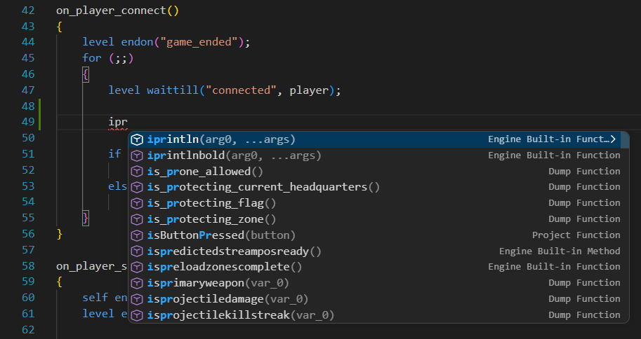
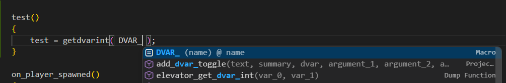

# GSCLSP (GSC Language Support)

Adds language support for `.gsc`, `.gsh`, `.csc`, and `.csh` files powered by the `GSCLSP` language server.

This README is a work in progress and will be updated soon previewing every feature.

## Features

### Target Game
- Switch your game being used in the bottom right corner once inside a GSC
- Changes built-in list and gives accurate diagnostics

### Syntax Highlighting
- Adds colored keywording
- Dead code zones for early returns and preprocessors

### Code Completion
- Local workspace & dump symbols
- Engine built-ins per target game
- Include-aware suggestions
- Macro and local variable completions
- Context-aware of local function and more
<div align="center">
  
  
</div>

### Go to Definition
- Local functions
- Included/dump function symbols
- Include/using/inline directive path targets
- Local/global variable & macro definitions

### Find References
- Lexer-based reference matching for better accuracy

### Hover
- Function signatures and docs
- Built-in, macro, and local/global variable info
- Directive include path preview

### Diagnostics
- Unresolved function calls (`gsclsp.unresolvedFunction`)
- Missing semicolon (`gsclsp.missingSemicolon`)
- Recursive function warning (`gsclsp.recursiveFunction`)
- Built-in argument count warning (`gsclsp.invalidBuiltinArgCount`)

### Code Actions
- Quick fix to insert `#include ...` for unresolved functions

### Diagnostic Mute Comments

Warnings can be muted on either:

- the **first line**
- or the **line above** the error

Supported format:

- `// gsclsp-disable: recursive-function`
- `// gsclsp-disable: missing-semicolon`
- `// gsclsp-disable: builtin-arg-count`
- `// gsclsp-disable: recursive, semicolon, builtin-args`
- `// gsclsp-disable: all`

Aliases supported:

- `recursive` -> `recursive-function`
- `semicolon` -> `missing-semicolon`
- `builtin-args` or `arity` -> `builtin-arg-count`

## Project Setup

When you open a workspace, the extension ensures a `gsclsp.config.json` file exists in the workspace root.

Example:

```json
{
  "dumpPath": "D:\\your\\gsc_dump"
}
```

## Command

- `GSC: Set Dump Folder Path` (`gsclsp.browseDumpPath`)
  - Opens folder picker
  - Updates `gsclsp.config.json`
  - Notifies the server to re-index dump symbols
